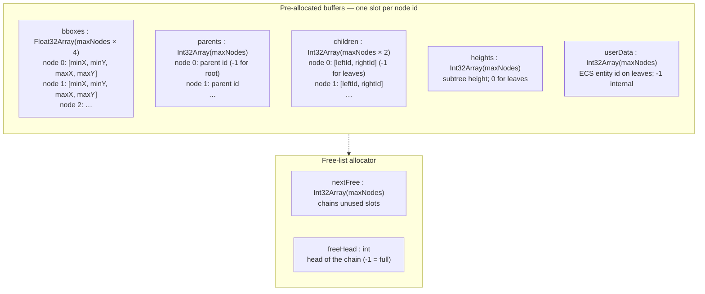
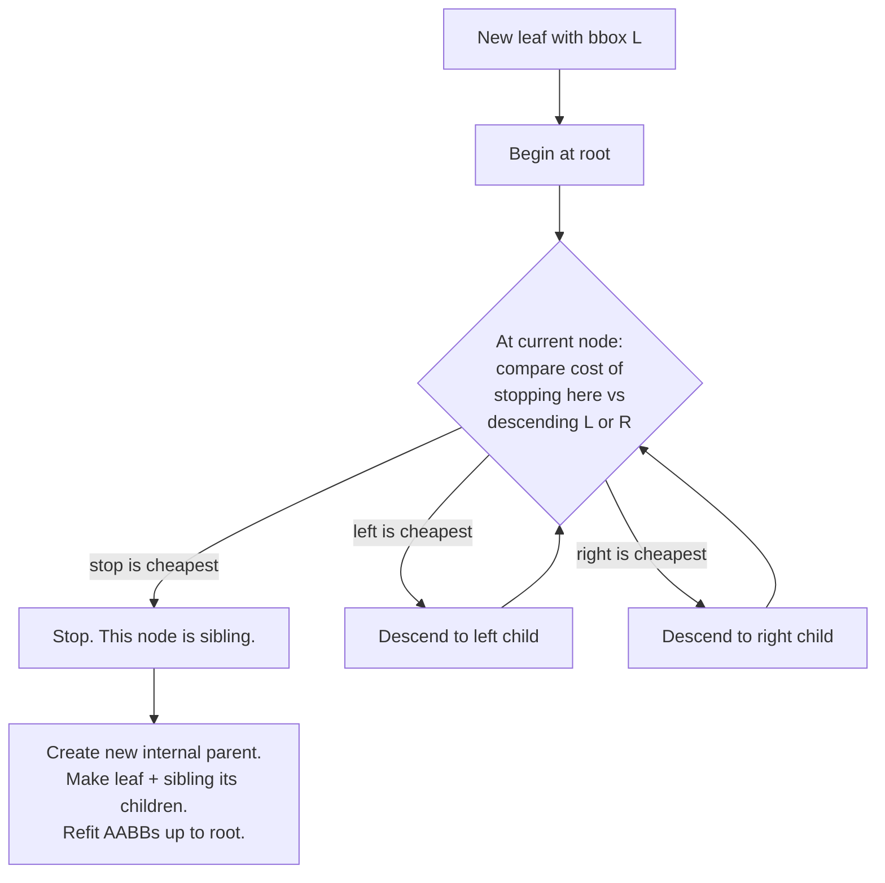
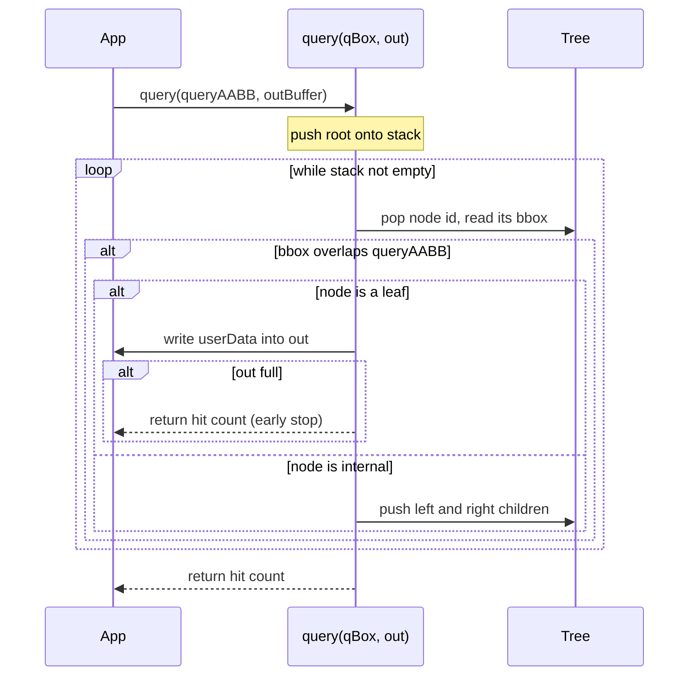
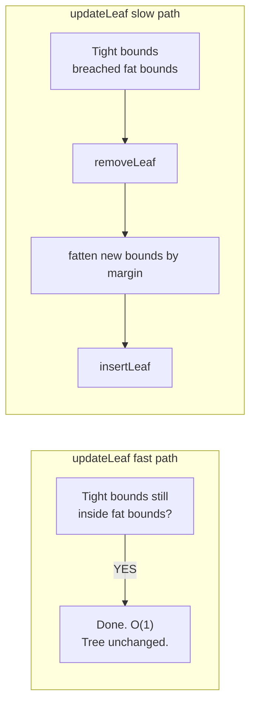

# @zakkster/lite-bvh

[](https://www.npmjs.com/package/@zakkster/lite-bvh)
[](https://github.com/sponsors/PeshoVurtoleta)

[](https://bundlephobia.com/result?p=@zakkster/lite-bvh)
[](https://www.npmjs.com/package/@zakkster/lite-bvh)
[](https://www.npmjs.com/package/@zakkster/lite-bvh)


[](https://opensource.org/licenses/MIT)

**Zero-GC dynamic Bounding Volume Hierarchy for 2D.** A flat Structure-of-Arrays AABB tree with O(1) free-list allocation, Surface Area Heuristic insertion, and an iterative query that writes hits into a caller-provided buffer. **No allocations after construction** — not in `insertLeaf`, not in `query`, not in the fast-path `updateLeaf`. A Box2D-style dynamic tree, transplanted to plain JavaScript and `Int32Array`/`Float32Array`.

```js
import { DynamicBVH2D } from '@zakkster/lite-bvh';

const tree = new DynamicBVH2D(4096);
const tight = new Float32Array(4);   // scratch — reused every frame
const hits  = new Int32Array(256);

// Insert each entity once at spawn time:
const nodeId = tree.insertLeaf(entityAABB, entityId);

// Per frame, per moving entity — fast path is zero-cost when no rebuild is needed:
setBoundsInto(tight, entity);
entity.nodeId = tree.updateLeaf(entity.nodeId, tight, MARGIN);

// Per frame, per query (viewport / mouse pick / explosion radius):
const n = tree.query(viewportAABB, hits);
for (let i = 0; i < n; i++) renderEntity(hits[i]);
```

---

## Contents

- [Why](#why) · [Install](#install) · [Quick start](#quick-start)
- [How it works](#how-it-works)
- [The fat-bounds trick (why `margin` matters)](#the-fat-bounds-trick-why-margin-matters)
- [API reference](#api-reference)
- [Sizing & memory](#sizing--memory)
- [Edge cases & guarantees](#edge-cases--guarantees)
- [Testing](#testing)
- [Limitations & roadmap](#limitations--roadmap)
- [License](#license)

---

## Why

You have **a few thousand moving things** — sprites, particles, bullets, tiles, hit-tested overlay layers — and every frame you need to answer questions like:

- "Which entities overlap this viewport rectangle?"
- "Which entities are near the cursor?"
- "Which entities should I test for collision against this swept AABB?"

Naively iterating all N entities is O(N) **per query**. A flat spatial grid is great until your entities cluster or sizes vary widely. An octree allocates a node object per cell. A class-based BVH allocates a node object per insert.

**`@zakkster/lite-bvh` allocates exactly five typed arrays at construction and never again.** Inserts, queries, updates, removes — all operate on indices into those pre-allocated buffers. The free-list reuses node slots in O(1) so a steady-state simulation has zero allocator pressure forever.

It's what you'd write if you read Box2D's `b2_dynamicTree.cpp` and re-translated the techniques into JS:

- **Flat SoA** layout — five contiguous arrays, one slot per node, indexed by integer node id. No `{ left, right, bbox }` object graph; the cache loves this.
- **Surface Area Heuristic** — inserts descend along the cheapest cost path, producing balanced trees even for irregular workloads.
- **Fat-bounds + dirty-check update** — moving entities take the O(1) fast path 90 %+ of the time; only when an object breaches its fat bounds does the tree restructure.
- **Iterative query** — explicit stack, no recursion, no closures, no per-hit object construction. Hits are integer ids written into your buffer.

### What this is *not*

- **Not a physics engine.** No contact resolution, no impulses, no shape primitives beyond AABBs. Use this as the broadphase under your own physics.
- **Not a nearest-neighbour index.** `query` (box), `queryPoint`, and `raycast` (segment) ship; `closestPoint` is deferred — it needs a priority queue with its own zero-alloc proof (see [roadmap](#limitations--roadmap)).
- **Not a 3D BVH.** This is 2D only. The savings on each node (4 floats vs 6) are real for the use cases this is built for.

---

## Install

```bash
npm i @zakkster/lite-bvh
```

ESM only. Zero runtime dependencies. Pairs with [`@zakkster/lite-aabb`](https://www.npmjs.com/package/@zakkster/lite-aabb) (same flat-array AABB format) but does not depend on it.

```js
import { DynamicBVH2D } from '@zakkster/lite-bvh';
```

---

## Quick start

```js
import { DynamicBVH2D } from '@zakkster/lite-bvh';
import { aabb2 } from '@zakkster/lite-aabb';     // optional but convenient

const MARGIN = 4;                     // world-units of fat to apply on insert/move
const tree = new DynamicBVH2D(4096);  // ~32 KB of buffers, room for ~2000 leaves

// ---- Spawn ----
const entities = new Map();           // entityId -> { x, y, w, h, nodeId }
function spawn(id, x, y, w, h) {
    const fat = aabb2.create();
    aabb2.set(fat, x - MARGIN, y - MARGIN, x + w + MARGIN, y + h + MARGIN);
    const nodeId = tree.insertLeaf(fat, id);
    entities.set(id, { x, y, w, h, nodeId });
}

// ---- Move ----
const tight = new Float32Array(4);    // reused across every entity, every frame
function move(id, newX, newY) {
    const e = entities.get(id);
    e.x = newX; e.y = newY;
    tight[0] = newX;       tight[1] = newY;
    tight[2] = newX + e.w; tight[3] = newY + e.h;
    e.nodeId = tree.updateLeaf(e.nodeId, tight, MARGIN);
}

// ---- Query ----
const hits = new Int32Array(256);     // sized for your worst-case batch
function visibleInViewport(viewportAABB) {
    const n = tree.query(viewportAABB, hits);
    return hits.subarray(0, n);       // view, not a copy
}

// ---- Despawn ----
function despawn(id) {
    const e = entities.get(id);
    tree.removeLeaf(e.nodeId);
    entities.delete(id);
}
```

---

## How it works

### Memory layout

Five typed arrays, one slot per node, all allocated up front.



Every operation either looks up a slot by integer id (single typed-array load) or writes through one (single typed-array store). There's no method dispatch, no property access through `this` into a Map or Object — the JIT sees plain indexed array math.

### Insert: Surface Area Heuristic descent

Inserting a leaf has to pick a **sibling node** — an existing node that the new leaf will share a parent with. Picking randomly produces deep, unbalanced trees that destroy query performance. Picking optimally is exponential. SAH is the principled heuristic: descend toward the child whose **change in surface area (perimeter, in 2D)** would be smallest, plus an inheritance-cost term that accounts for the bounding box growth that propagates up to the root.



The cost function compares the perimeter of the *merged* box at each step, plus an *inheritance cost* for box growth that propagates to ancestors. This produces the balanced, low-area trees that make queries cheap.

### Query: iterative DFS over the tree

No recursion — recursion in V8 creates a stack frame per call, and for trees of depth 20+ that's measurable cost on a 60 fps budget. The query reuses a single `Int32Array` stack across every call.



The traversal stack is **fixed-size and never grows.** The DFS uses at most `height + 1` slots, and tree rotations (below) keep height at O(log n), so the 256-slot stack is never exhausted by a well-formed tree — a balanced tree would need ~2^250 nodes to fill it. If it ever overflows, the tree is more degenerate than rotations permit (i.e. corrupt), and `query` throws rather than silently allocating a bigger stack inside the hot loop. (Before v1.2.0 the stack doubled on overflow, which an adversarial insert order could trigger — a silent allocation in the query path. See [B-08](CHANGELOG.md).)

---

## The fat-bounds trick (why `margin` matters)

The big insight that makes a dynamic AABB tree fast under motion: **every leaf stores a "fat" AABB, slightly larger than the entity's actual bounds.** As long as the *tight* bounds stay inside the *fat* bounds, the tree topology doesn't need to change at all — the leaf's bbox in the tree is still valid as an over-approximation. Only when an entity moves *outside* its fat bounds does the leaf get removed, re-fattened, and re-inserted.



For a typical particle / sprite workload with a sensible margin, the fast path hits **>95 % of frames per entity**. Only when something teleports or starts moving fast does the tree restructure.

### Picking a margin

| Margin | Behavior |
|---|---|
| **Too small** (≈ 0) | Almost every move triggers a re-insert. The tree stays tight, but updates are slow and the query results contain only the strictly-overlapping leaves. |
| **Too large** (≫ entity size) | Re-inserts are rare and cheap, but queries return many false-positive hits — the caller has to filter them out with a second tight-bounds check. |
| **Sweet spot** (≈ 1–4× one frame's expected movement) | ~95 % fast-path updates, modest query bloat. Tune by profiling. |

`margin` is the single most important parameter you'll tune. A common rule of thumb: set it to **expected velocity × 2 frames** in world units.

---

## API reference

### `new DynamicBVH2D(maxNodes)`

| Arg | Type | Description |
|---|---|---|
| `maxNodes` | `number` | Hard cap on total nodes (leaves + internal). Sized for the lifetime of the tree. |

A tree holding `N` leaves uses at most `2N - 1` total nodes (when fully populated). Rule of thumb: `maxNodes = 4 × expectedEntities` gives plenty of headroom.

### Instance members

| Member | Type | Description |
|---|---|---|
| `maxNodes` | `number` | As constructed. |
| `nodeCount` | `number` | Live nodes (leaves + internal). Useful for telemetry. |
| `leafCount` | `number` | Live leaves. O(1). |
| `height` | `number` | Root height in edges: `-1` empty, `0` a single leaf, else the longest root-to-leaf path. O(1); tracks ~`ceil(log2(leafCount))`. |
| `root` | `number` | Root node id, or `-1` if empty. |
| `bboxes` `parents` `children` `heights` `userData` | TypedArray | The SoA backing arrays. Read-only in practice; exposed for debug visualization and unit tests. |

### Methods

| Method | Returns | Description |
|---|---|---|
| `insertLeaf(leafAABB, data)` | `number` (node id) | Inserts a leaf. **Store the returned id.** `data` must be a non-negative int32. **Throws** — atomically, before any mutation — at capacity, on a non-finite or inverted box, on a bad `data`, or on a box aliasing the tree's own `bboxes`. |
| `insertLeaves(packed, dataArray, count)` | `number` (`count`) | Bulk insert of `count` boxes from one packed `Float32Array` (`4×count` floats, box `i` at `[4i, 4i+3]` — the [FORMAT.md](FORMAT.md) packed layout, and what `@zakkster/lite-aabb`'s `fattenAll`/`mergeAll` produce). Reads by index — **zero per-box allocation**. **Batch-atomic**: validates every box, `data`, alias, and capacity before any mutation, so a single bad element **throws with the tree byte-unchanged** (never a partial batch). |
| `removeLeaf(leaf)` | `void` | Removes a leaf, heals the gap, returns nodes to the free list. **Throws** on an invalid, freed, or non-leaf (internal) handle. |
| `updateLeaf(leaf, newAABB, margin)` | `number` (node id) | Fast path: returns `leaf` unchanged if still contained. Slow path: removes, fattens by `margin`, re-inserts; returns a (possibly new) id. **Throws** on an invalid/freed handle, or (slow path, atomically) when the fattened box is non-finite or inverted. **Always reassign your stored handle from the return value.** |
| `query(queryAABB, outBuffer)` | `number` (hit count) | Writes intersecting leaves' `userData` into `outBuffer`. Stops early when the buffer fills; a zero-length buffer returns `0`. Read-only — takes no quarantine door, so a non-finite or empty-sentinel query box returns `0` rather than throwing. Never allocates (the fixed traversal stack throws fail-closed on the impossible overflow rather than growing). |
| `queryPoint(x, y, outBuffer)` | `number` (hit count) | Leaves whose fat bounds contain `(x, y)`. Equals `query([x,y,x,y], out)` by construction — skips building an AABB for mouse/touch picking. Reuses the query stack (same no-grow policy); non-finite coords return `0`. |
| `raycast(p0x, p0y, p1x, p1y, outBuffer)` | `number` (hit count) | Leaves a segment `p0→p1` touches or crosses (slab test over `t ∈ [0,1]`). **No callback** — it would re-enter user code while the shared stack is held; hits go into `outBuffer`. Zero-length segment ≡ `queryPoint(p0)`; a non-finite endpoint returns `0`. |
| `clear()` | `void` | Reset to empty **without reallocating** any buffer (scene reloads, reset loops). O(maxNodes). Fails closed: a handle held across `clear()` throws afterwards. |
| `getBounds(leaf, out4)` | `Float32Array` | Reads a leaf's stored fat bounds (f32-exact) into `out4` and returns it — the supported alternative to indexing raw `bboxes`. **Throws** on an invalid, freed, or internal handle. |
| `validate()` | `true` | **Debug/test only, O(n).** Throws naming the first offending node if the tree is inconsistent. Never call it on a hot path. |

### Conventions

- **AABB format:** `Float32Array` of length 4, `[minX, minY, maxX, maxY]`. Identical to `@zakkster/lite-aabb` format. A box must be finite and non-inverted (`minX <= maxX`, `minY <= maxY`) to enter the tree. A plain `Array`/`Float64Array` is accepted and coerced to f32, but pass a `Float32Array` — the `updateLeaf` fast path compares against f32-rounded bounds, so a `Float64Array` within one f32 ulp of the fat boundary can slip the fast path (a silent miss).
- **FORMAT contract:** the exact shared layout (single box, packed `4×N`, touching-edge, aliasing, margin floor) is pinned in [FORMAT.md](FORMAT.md), byte-identical with `@zakkster/lite-aabb`. Both packages export `FORMAT_VERSION` (an integer, currently `1`, on a separate axis from the semver `VERSION`); assert them equal when mixing versions of the two. It is copied inline here — no runtime dependency.
- **Packed `4×N`:** N boxes in one `Float32Array`, box `i` at slots `4i..4i+3`. What `insertLeaves` consumes and what `@zakkster/lite-aabb`'s `fattenAll`/`mergeAll` produce.
- **`userData`:** a **non-negative int32** (`[0, 2^31-1]`). `-1` is reserved as the internal-node sentinel; `2**31` and `3.7` (which would wrap/truncate) are rejected at the door.
- **`outBuffer`:** caller-owned `Int32Array`. The library never holds a reference past the call.

---

## Sizing & memory

Each node consumes:

| Field | Bytes |
|---|---:|
| `bboxes` slice | 16 |
| `parents` slice | 4 |
| `children` slice | 8 |
| `heights` slice | 4 |
| `userData` slice | 4 |
| `nextFree` slice | 4 |
| **Total** | **40 bytes / node** |

A `DynamicBVH2D(4096)` is therefore **~160 KB** of backing buffers, comfortably below the Twitch Extension 1 MB bundle cap and trivial for any other deployment. A million-leaf tree is **~80 MB** — still feasible, but at that scale you should look at chunking / paging strategies above the BVH.

---

## Edge cases & guarantees

- **Capacity exhaustion throws synchronously** at `insertLeaf` — at the *boundary*, never partway through. Capacity is reserved before the first write, so the tree is left byte-unchanged and still valid; keep using it.
- **Handles are validated, fail-closed.** `removeLeaf` and `updateLeaf` throw on a handle that is out of range, non-integer, an internal node, or already freed — so a double-remove or a stale id can never silently corrupt the tree. The check is O(1) (a range test and one array read); it does not walk the tree.
- **Poison is quarantined at the door.** A non-finite (NaN/Infinity) or inverted box can no longer enter the tree and silently kill it — one NaN leaf used to propagate to the root and make every query return `0` forever. `insertLeaf` (and `updateLeaf`'s slow path, before it removes anything) reject it atomically. The `updateLeaf` fast path and `query` inner loop take **no** new instructions — a query box is never stored, so it needs no door. `validate()` is the backstop: it now names any non-finite or inverted bbox.
- **`updateLeaf`'s fast path is O(1).** The handle check (a range test + one `children` read), then four `bboxes` reads and four `<=/>=` comparisons. No allocation — gated by the torture suite at `maxArrayBuffersGrowth: 0`.
- **`validate()` is available for tests and debugging.** It re-derives every structural invariant in O(n) and throws on the first violation. Not for hot paths.
- **Removing the root** transitions the tree to empty cleanly (`root = -1`, `nodeCount = 0`).
- **Removing one of two leaves** promotes the surviving sibling directly to the root, freeing the internal parent.
- **`query` is reentrant-safe within a single thread** — the stack is per-instance state but each call reads it from `stackPtr = 0` to `stackPtr = 0`, so back-to-back queries don't interfere. Don't share an instance across Workers.
- **`Float32` precision (~7 decimal digits)** is fine for typical world bounds; for million-unit scenes consider chunking or swapping the type.
- **The tree self-balances with rotations.** `_refit` applies Box2D-style single rotations on every insert and remove, so `height` stays O(log n) regardless of insert order. A monotone (sorted) insert of 20,000 leaves — which used to build a height-19,999 linked list — is now height 15, and building it is ~300× faster. Watch `tree.height` to confirm; the torture suite pins it `<= 2·ceil(log2(leafCount)) + 2` under every adversarial order.

---

## Testing

```bash
npm test         # node:test unit suite + structural-integrity regressions
npm run torture  # zero-GC / structural gate → prints exactly "ok"
npm run verify   # both, in order
```

`npm test` runs the `node:test` suite (`test/Bvh.test.js` + `test/regressions.test.js`), covering:

| Group | What's tested |
|---|---|
| Construction | SoA sizes, free-list chain, initial state, `maxNodes` validation |
| Insert | single leaf, internal parent creation, distinct ids, atomic capacity throw |
| Query | empty tree, single leaf, miss, multiple hits, enclosing query, touching edges, early stop, zero-length buffer |
| Query kinds | `queryPoint` ≡ degenerate box query; `raycast` hand-pinned (miss, start-inside, along-edge, zero-length) and ≡ `queryPoint` for a zero-length segment |
| Remove | only leaf, sibling promotion, unfindability, capacity reusability |
| Update | fast path (same id), slow path (new id), user-data preservation, margin correctness |
| Clear & bounds | `clear()` reuses buffers, fails closed on stale handles, rebuilds identically; `getBounds` f32-exact round-trip |
| Bulk & format | `insertLeaves` ≡ N single inserts, batch-atomic reject, capacity/shape guards; `FORMAT_VERSION` agrees with `@zakkster/lite-aabb`; `aabb2.fattenAll` → `insertLeaves` → query round-trip |
| Telemetry & rotations | `height`/`leafCount` accessors; monotone insert stays height-bounded |
| Regressions | every S1/S2 finding (B-01…B-13, A-05) has a named before/after test |

The **zero-allocation guarantee is not a heap-growth heuristic.** It is gated by the torture suite (tier T6) at `maxArrayBuffersGrowth: 0` with `stabilize: 'deep'`, plus a direct `queryStack.length` / `bboxes.buffer.byteLength` assertion — because the tree's buffers live in ArrayBuffer backing stores *outside* the V8 heap, where a heap-growth gate is blind. T6 gates all three query kinds (`query`, `queryPoint`, `raycast`) and the packed `insertLeaves` bulk path. Tier T5 (differential fuzz against a brute-force O(N) oracle) fuzzes all three query kinds against independent oracles — plus a bulk-vs-single differential — proving rotations change the tree's shape but never its answers; tier T8 proves cross-package agreement with `@zakkster/lite-aabb`, including the `FORMAT_VERSION` handshake and the packed round-trip. `node --expose-gc test/torture.mjs` prints exactly `ok`.

---

## Limitations & roadmap

`queryPoint`/`raycast`/`clear()`/`getBounds()` shipped in v1.3.0; the packed batch ops and the shared FORMAT contract shipped in v2.0.0. Only one item remains deferred:

| Feature | Why | Status |
|---|---|---|
| **`closestPoint(p, outBuffer)`** | Nearest-leaf to a point with optional max-distance cap. | **Deferred** — needs a best-first traversal ordered by distance, i.e. a priority queue: a second data structure with its own zero-allocation proof (a pre-allocated binary heap). Shipping it means allocating per query or proving a heap zero-alloc; that is its own session, not a footnote. See [decision 0004](decisions/0004-query-kinds.md). |
| **Packed batch ops** (`insertLeaves`, packed `4×N` feed) | Broadphase feeding without a per-box view. | **Shipped in 2.0.0** — `insertLeaves`, plus the shared [FORMAT.md](FORMAT.md) contract / `FORMAT_VERSION`, twinned with `@zakkster/lite-aabb@2.0.0`'s `fattenAll`/`mergeAll`/`intersectsAny`. |

> **Note on `raycast`.** It takes scalar endpoints and writes hits into a caller buffer — **not** the `raycast(p0, p1, callback)` form an earlier roadmap sketched. A per-hit callback re-enters user code mid-traversal while the shared query stack is held, so a nested query from that callback would corrupt it. Iterate the returned prefix instead.

PRs welcome. If you adopt this for a shipping product and want `closestPoint`, get in touch.

---

## License

MIT © Zahary Shinikchiev
